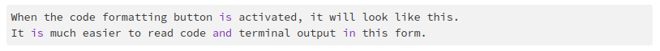
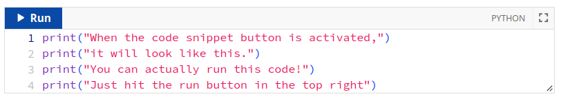

Getting Help
============

There are two primary ways to get help in this class; Ed Discussion
and office hours. Many problems can be handled effectively and
efficiently on Ed. Some problems can only be handled during office
hours.

Ed Discussion
-------------

At this point in your CS studies, you have likely used Ed Discussion
(hereafter called Ed) several times already. So, just a few reminders on
how to use Ed effectively:

- Ed should be your primary means of getting help, with office hours
  being a secondary means of support whenever something is hard to
  resolve over Ed. You will often get help faster on Ed, a opposed
  to waiting until the next available office hours.

- To be able to help you on Ed we need you to "help us help you." Over Ed,
  we cannot see what you are seeing on your computer, which can make it
  challenging to debug the issue you're encountering.  That is why it is
  crucial that, when you ask a question on Ed, you provide as much
  information as possible. Below you will find some general guidelines
  on how to ask questions effectively (if you've taken CS 141/142, these
  are the same guidelines used in those classes)

- Sometimes, you will ask a question and the immediate response will be a
  referral to this page along with instructions to include more
  information in your question. We realize this can be frustrating,
  but please know that we are not trying to be difficult,
  nor do we want to be dismissive of your question. If we point you
  to this page, it is because we genuinely cannot help you unless you
  provide more information, or because we need to enforce these
  policies to make the system run efficiently enough that we can
  get to all of the questions and spend our time answering them well.

Asking Questions
----------------

As you work through your coursework, many of you will
probably have questions or will encounter issues that you are not sure
how to deal with.  Ed provides a convenient mechanism to ask
questions, but it can sometimes be challenging to provide assistance
if you do not provide the right information when asking a
question. Here are a few suggestions that may help you ask questions
more effectively on Ed:

Before you post a question:

* **Search before asking**. Before posting a question on Ed, check whether it has already been answered in a previous post. We realize the volume of posts can be overwhelming, but you should start by using Ed's search functionality to see if it brings up any relevant posts. For example, suppose you are failing a specific test in one of the projects; you could search just for that test's name to see if any other students have encountered that same error (and, if you're lucky, an instructor/TA will have already answered it).
* **Make sure to always check the "pinned" posts**. We will often "pin" a post titled "Must-read posts for [assignment name]" with links to  posts that address common issues and questions on that assignment. You can find the pinned posts at the top of the left sidebar, under "Pinned".  Make sure you check those posts first.
* **Make sure you ask an actual question**. You need to tell us about a specific issue you're encountering, and why you're stuck on it  (e.g., you are not getting the expected result, the tests are failing in a way you do not understand, etc.). Writing a post that says  "I can't get Task 4 to work, I've pushed my code. Please look at it." is not a question!  Please note that we're happy to help you work through a task you're having trouble with and may ultimately suggest that you come to office hours for this but, on Ed, you have to make sure you’re asking a specific question.
* **Push your code** If your question relates to your code, make sure you add, commit, and push your code to GitHub before asking for help.

Should I use a public or private question?

* **Private questions are for personal matters**. Ed has a mechanism that allows you to ask a private question, which will be seen only by the instructors and teaching assistants. This mechanism should be used only for truly private matters that relate uniquely to you (e.g., you need to notify us of a family/medical emergency, etc.).

  In general, all questions about coursework, course logistics, etc. should be asked publicly. If you ask such a question privately, we will not answer it. We will ask you to ask it publicly, and will answer it once you do. This way, everyone can benefit from the answer to the question and, if someone runs into the same issue you do, we can refer them to the answer we provided in your post. Please note that you do have the option of asking your question publicly *and* anonymously if you prefer (please note that your question will appear anonymous to other students in the class, but not the course staff).

What to include in your question:

* **The more information, the better**. We know that, in some classes, you may feel the need to be brief and concise when asking for help to "avoid wasting the professor's time" or because "professors don't have time to read long e-mails". The absolute opposite is true in this class. When asking for help, make sure you ask a specific question and provide us with enough information to answer it.

  In particular, it will be much easier for us to help you if we are able to reproduce the exact issue you are encountering (i.e., when we run your code, we must be able to observe the exact same issue you're encountering). And to do so, we need as much information as possible from you:

* **Include a detailed description of the exact chain of events that lead to the issue you're encountering.** Are you testing a specific function? If so, with what inputs? Does the issue come up when you run a test? Etc.
* **Include ALL the output from the command that generates an error** If you encounter an error message (or any other unexpected output) when running a command or a specific test, please make sure you include the **full and unabridged** error message (or unexpected output). Summarizing the message  (e.g., "The tests says it was expecting value 42, and I'm pretty sure that's what I'm returning") makes it harder for us to figure out what the issue is. **Please use the code block mechanism to format any output you include.** (see "Posting Terminal Output or Code on Ed" below)  Unformatted output is often unreadable.
* **If something is "wrong", please describe in what way it seems wrong to you.** For example, were you expecting a particular output but got a different one? Is a piece of code behaving in a way you were not expecting? Etc. It can be useful to tell us what you were expecting the code to do, and what you encountered instead.

What *not* to include in your question:

* **Never post your code in Ed**. As noted in our `Academic Honesty <academic-honesty.html>`__ policies, you should never share your code with other students, which means you should never post it on Ed. If you need us to look at your code, just push it to GitHub and we will look at it there. Please note that, if a test prints out a few lines of code as part of its output, that is ok.

* **No screenshots**. Do not post screenshots of the output. Screenshots are not searchable, and may pose readability issues for some people. Instructors/TAs may also want to copy-paste that output somewhere else, which is not possible if you post a screenshot.

  If you need to share some output with us, copy-paste from the terminal onto Ed, and use Ed's "code block" formatting (see "Posting Terminal Output or Code on Ed" below). To copy something on the terminal, just select it the same way you would do in a word processor (click, and then drag until the end of the output) and press Control-Shift-C (Command-C on MacOS).

Other notes:

* **Anonymous questions** Please note that when you ask a question anonymously, the question will be anonymous to your fellow classmates, but not to the course staff.
* **One question, one post**. Avoid posts that have multiple unrelated questions. Instead, write a separate post for each question. Please note that it is ok to ask multiple questions in one post if they all relate to the same issue.
* **Comments vs Answers**. If you need to provide additional information on a question, or have a follow-up question, make sure to always use a "comment" (by clicking on "Comment" below your question).  Only fill out the "answer" field if you have resolved the issue on your own, or if you are providing an actual answer to someone else's question.
* **Turnaround** We aim for a 24 hour turnaround time on all Ed Discussion questions on weekdays, and a 48 hour turnaround time on weekends.  Please note that we cannot guarantee we will answer a question before the deadline if it is asked the day an assignment is due. We will do what we can, but we encourage you to start your work early, so that if you have questions there will be sufficient time for us to answer them.

Posting Terminal Output or Code on Ed
-------------------------------------

In some cases, you may need to share terminal output (i.e. the output you get when running commands) or code as part of asking a question on Ed. When doing so, it is important that you use Ed's code formatting; otherwise, the output may not be readable in your post. We provide below some pointers on how to use Ed's code formatting functionality.

Below is a screenshot of the toolbar that you will see when writing Ed posts. We've highlighted a few buttons of interest.

Code formatting
~~~~~~~~~~~~~~~

The button highlighted in yellow (next to the underline icon) is the code formatting button.

When the code formatting button is activated, it will look like this:

Code Snippets
~~~~~~~~~~~~~

The button highlighted in red (next to the button labeled with sigma) is the code snippet button. This mechanism is best used for small amounts of code.

Preview post
~~~~~~~~~~~~

The button at the end of the row and highlighted in blueish-green is the preview button. You can use this to see what your post will look like before you post it. Why does this matter?

An issue we've noticed when terminal output is copied and pasted into a post, the formatting may not be what you've expected. This is because the shell prompt often looks something like this::

    amr@linux1$

Why is that an issue? It turns out the dollar sign $ actually means something on Ed, but it is not obvious. Text that is surrounded by dollar signs is interpreted as mathematical typesetting. For example, I can type something complicated-looking like :math:`\delta : Q \times \Sigma^* \to 2^Q` by writing the following on Ed::

    $\delta : Q \times \Sigma^* \to 2^Q$

Notice that Ed will interpret the text above as math because it was surrounded by dollar signs, but it did not do the same for text that is code-formatted.

To avoid having your output incorrectly interpreted as math, always make sure your terminal output has code formatting applied to it! And if you're not sure about this, you can use the preview post button to see what your post looks like before you post it.

Office Hours
------------

Sometimes you will face questions that are too hard to debug on Ed,
or where you just need more conceptual help understanding what you
are supposed to do in an assignment. In those cases, you are welcome
to come to office hours. Here are a few tips and suggestions to make the
most of office hours:

* Prepare questions ahead of time. Time in office hours can be  limited –-particularly near deadlines-– and so knowing what you need help with beforehand will let you make the most of your time.

* Make a list of known unknowns. Along the lines of the previous point, knowing what you do not fully understand is a time saver.

* If you want help with a bug, please make sure your are ready to get help when it is your turn.  That means your machine needs to be turned on and your code needs to be up on the screen.  Also, make sure your code is pushed to GitHub, in case the person helping you wants to look at it on their own machine.

* While we will sometimes be able to quickly point out what is wrong with your code, please understand that we cannot debug all your code for you. Other times, your problem will require more effort. In those cases, the job of the person helping you is to get you to the point where you can continue to make progress on your own. Please understand that we cannot sit down with you and debug all your code for you until it is working perfectly.
