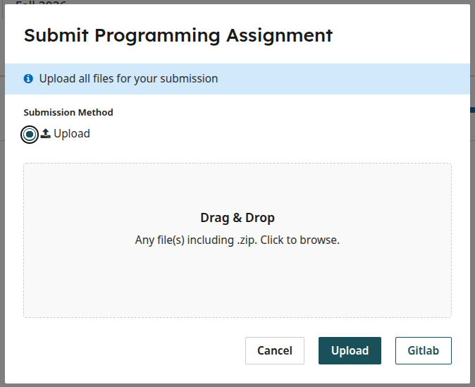
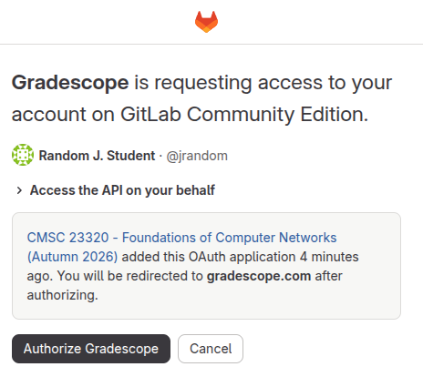
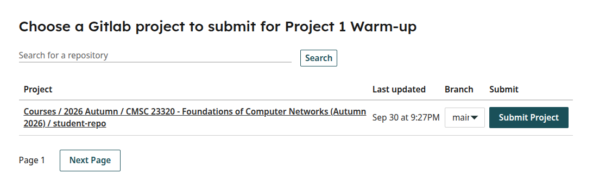

.. _project_gitlab:

Projects - Submitting from GitLab
---------------------------------

This page explains how to submit your GitLab repository directly into Gradescope.

Once you are ready to submit, you will be shown this form on Gradescope:

Please ignore the "Upload" button. Instead, click on the **Gitlab** button.

**NOTE**: If you're accessing Gradescope from inside Canvas, you may be shown
some sort of "page cannot be accessed" message. If so, please try completing
these steps by logging directly into `https://www.gradescope.com/ <https://www.gradescope.com/>`__

If this is the first time you submit from Gradescope, you will be asked to
confirm that you want to authorize Gradescope to access your Gitlab account:

Click on "Authorize Gradescope"

Afterwards (and in subsequent submissions), you will be shown a list of the
repositories you have access to:

Make sure you select the correct branch (typically ``main``), and click on "Submit Project"
